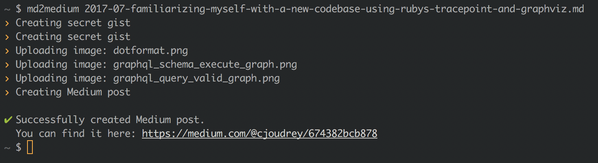
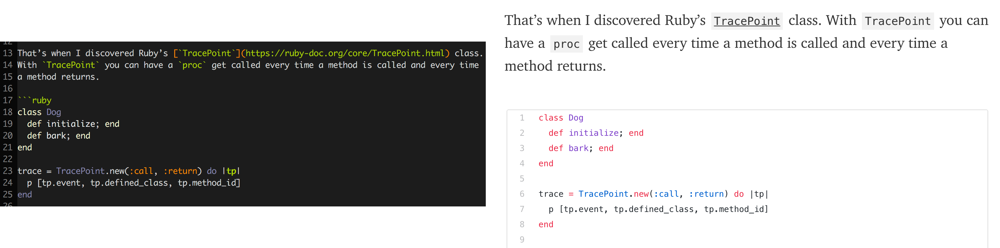
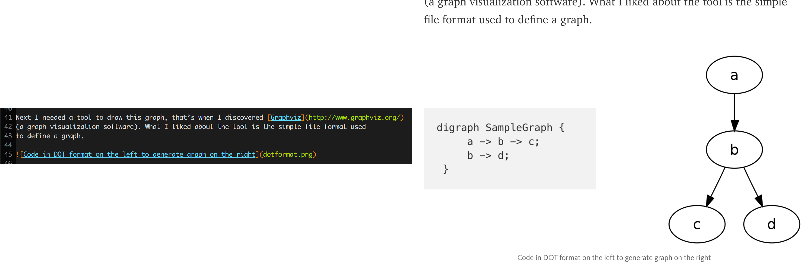

# md2medium

Write your blog posts in Markdown and publish them on Medium using `md2medium`.



## Install

`md2medium` requires Go 1.8 and can be installed using:

```
go get -u github.com/cjoudrey/md2medium
```

## Usage

Once installed using `md2medium` is as simple as:

```
$ md2medium my_article.md
```

## Features

**Syntax highlighting**

Medium does not support syntax highlighting of code blocks. Instead, you must
create gists and embed the gists in your article.

`md2medium` makes this chore much easier by automatically creating gists
for any code blocks in your Markdown file:



**Image caption**

When specifying an `alt` for an image in Markdown, `md2medium` will include it
under the image:



**Metadata extraction**

By embedding [YAML](http://yaml.org/) metadata at the top of a Markdown file, extra information can be sent to Medium.

For now, only tags can be specified in this format.

Example usage:

```markdown
---
tags: [GraphQL, Ruby]
---

# My article about GraphQL and Ruby

Lorem ipsum dolor sit amet, consectetur adipiscing elit.
```

## Contributing

Bug reports and pull requests are welcome on GitHub at https://github.com/cjoudrey/md2markdown. This project is intended to be a safe, welcoming space for collaboration, and contributors are expected to adhere to the [Contributor Covenant](http://contributor-covenant.org) code of conduct.

## License

The package is available as open source under the terms of the [MIT License](http://opensource.org/licenses/MIT).
